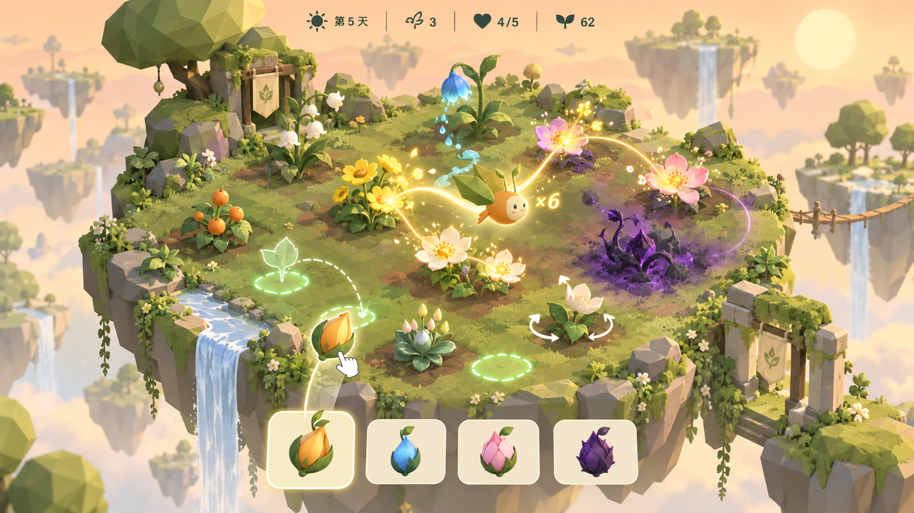

# Mosswing · 浮岛造境 2.0“织风巡游”执行文档

> 文档 ID：`DOC-GARDEN-V2-001`
> 版本：`v0.1`
> 日期：`2026-09-13`
> 状态：效果图方向已获用户确认；执行文档待批准；`M7` 尚未开始
> 上游基线：`mode-floating-garden-execution.md` 中已完成的 `M0～M6` 与 `v1.0.1`
> 实现原则：先验证好玩，再扩大制作；每阶段独立验收，未批准不进入下一阶段



---

## 1. 文档目的

本文档是“浮岛造境 2.0：织风巡游”的唯一实施基线，用于指导后续 Codex 分阶段修改代码。

本次改造不是在现有界面上增加动画，而是将核心体验从“点击按钮、阅读文字、等待结算”改为：

> 拖拽种植 → 即时看见生态关系 → 亲手画出风流 → 引导 Mosswing 完成授粉连锁 → 看浮岛在场景中成长

本文档必须同时解决三个问题：

1. 主循环缺少直接操作。
2. 植物、资源和结算过度依赖文字。
3. 12天流程的每日节奏和结果表现过于重复。

---

## 2. 产品定位与成功标准

### 2.1 核心幻想

玩家不是在填一张棋盘表格，而是在触摸、组织和唤醒一座活着的浮岛花园。Mosswing 不再只是结算动画，而是玩家直接引导的生态伙伴。

### 2.2 体验支柱

- `PILLAR-01 触摸造境`：种植、移动、旋转和清理都必须有直接操作感。
- `PILLAR-02 织风授粉`：规划决定花园上限，玩家手法决定当日连锁表现。
- `PILLAR-03 一眼看懂`：优先用形状、动画、连线、声音和节奏表达规则。
- `PILLAR-04 每天有变化`：12天必须形成可感知的四段节奏，而不是重复12次同一页面。
- `PILLAR-05 想再画一条`：每局都能产生一条可回看、可优化的个人授粉路线。

### 2.3 可验收成功指标

- 主循环中至少 `80%` 的有意义操作由拖拽、滑动、长按或路径绘制完成。
- 规划与巡游阶段中，不应出现超过 `5秒` 没有玩家输入或明显场景反馈的空档。
- 主界面不得出现超过 `18个中文字` 的常驻说明段落。
- 新玩家不打开详细说明，可完成“拖入一颗种子→画出风流→访问三朵花”。
- 同一花园状态下，不同授粉路径必须产生可解释的不同结果。
- M7 内部可玩测试至少 `5人`，其中至少 `4人` 在没有要求的情况下主动再玩一次原型，才允许进入 M8。

---

## 3. 范围与非目标

### 3.1 本次必做

- 保留当前 `5×5` 逻辑棋盘，改成有机浮岛视觉布局。
- 将种植、移动、旋转和清理改为直接操作。
- 用“织风巡游”替代原本自动授粉预演的核心地位。
- 重做飞行路径、开花、资源流、污染和心芽反馈。
- 将日报改为场景内即时结算和一行摘要。
- 增加四段日期节奏、特殊夜晚和局外浮岛成长。
- 保留并迁移现有存档、图鉴、记忆种子、任务与战绩。
- 保留原飞行模式，新模式不得注册重复全局事件或破坏飞行循环。

### 3.2 本轮不做

- 不增加多人、排行榜、账号、付费、体力或广告。
- 不增加实时战斗、武器、敌人血条或开放世界。
- 不以增加更多文字卡牌作为留存方案。
- 不在 M7 原型阶段制作全部精细模型和全部局外成长内容。
- 不修改原飞行模式的物理、障碍和计分规则。
- 不要求联网；单文件离线成品约束继续有效。

---

## 4. 冻结视觉目标

### 4.1 参考图的权威性

`mosswing/src/design/floating-garden-v2-concept.png` 是 M7～M12 的主视觉方向，SHA-256 为：

`65a1a0f54b7eb7cb8f94986ce59fc8e0d01d32e4ed2db0af4e6451839cef7f22`

它冻结的是体验和构图，不是要求逐像素复制所有植物模型。

### 4.2 必须保留的视觉特征

- 主浮岛占终端可用画面约 `70%～78%`。
- 采用温暖桃色天空、奶油色雾气、苔绿主体、金色花粉与青色水流。
- 花园保留 `5×5` 逻辑吸附点，但非操作期默认隐藏方格边界。
- Mosswing 位于画面内而非面板中，风流为可绘制的亮金曲线。
- 光、水和授粉关系用不同粒子、轨迹和节奏表示，不只依赖颜色。
- 污染为紫黑色有机碎晶/藤蔓，必须明显扰动风流。
- 顶部只保留天数、行动力、心芽生命、繁荣四组常驻指示。
- 底部为图形化种子袋，不使用大段卡牌说明。
- 常驻面板不得遮挡主花园；弹层只用于暂停、设置、图鉴和终局。

### 4.3 允许调整

- 根据真实触摸命中区调整浮岛透视和摄像机俯角。
- 根据性能将精细叶片减化为批处理低多边形。
- 移动端允许减少远景浮岛数量和粒子密度。
- 为了读屏、键盘和强制颜色模式，允许保留不可见语义控件或高对比替代层。

---

## 5. 2.0 完整单日循环

### 5.1 黎明 `DAWN`

- 用 `900～1400ms` 场景转场公开天气。
- 行动力恢复，心芽以脉冲表现黎明能力。
- 不显示规则段落；天气通过天空、风向、地表和一枚图标表达。

### 5.2 选种 `DRAFT`

- 三枚种子荚从花园边缘升起，玩家横向拖入一枚种子袋。
- 默认只显示植物外形、光/水需求图标和稀有标记。
- 长按 `350ms` 才展开详细说明。
- 手牌超限时，将旧种子拖到屏幕边缘的堆肥叶片区，不再打开独立二次选择层。

### 5.3 触摸造境 `PLANNING`

玩家可以不受计时器限制地规划，但仍受行动力和现有模型合法性约束。

- 拖动种子到吸附点：种植。
- 长按已种植物 `220ms` 后拖动：移动。
- 拖动植物周围方向环：旋转。
- 按住心芽并将 Mosswing 拖到污染格盘旋：清理。
- 向下快速滑动当前拖拽物，或按 `Escape`：取消本次手势。
- 左下角叶片回旋图标保留撤销，但不作为主要操作。

规划期内必须实时显示即将变化的光、水和开花关系，不再需要单独点击“预演”才能看见。

### 5.4 织风准备 `ROUTE_READY`

- 玩家将 Mosswing 从心芽向外拖动超过 `0.45格`，自动进入织风。
- 当日可开花植物以明暗呼吸显示，污染区产生紫色扭曲圈。
- 风力预算用 Mosswing 周围的金色环表示，不显示长文字。

### 5.5 织风巡游 `WEAVING`

- 指针/手指按住时绘制连续风流，Mosswing 以短延迟跟随路径。
- 经过开花植物的命中区即完成授粉，花朵当场盛开并把花粉注入风流。
- 连续命中不同花朵增加连锁；重复经过同一朵花不重复计分。
- 接触污染会扭曲路径、消耗风力并中断当前连锁，但不会立即让本日失败。
- 松开指针后提交当前路径；路径长度不足 `0.8格` 或未命中任何花时，视为取消，不消耗当日结算。
- 若终点位于心芽 `0.55格` 内，触发“归巢”反馈；否则 Mosswing 沿最短曲线自动返回，不惩罚新玩家。

### 5.6 生态响应 `RESOLVING`

- 已生成的确定性事件以 `2～4秒` 连锁动画播放。
- 玩家的风流和命中顺序是结算输入，表现层不得二次重算结果。
- 不再显示六格统计日报。繁荣以花瓣飞入顶部计量环，心芽伤害以场景失色和裂纹表达。

### 5.7 夜晚 `NIGHT`

- 污染生成/扩散在场景中直接发生。
- 底部只出现一行摘要，格式为：`第5夜 · 繁荣 +8 · 连锁 ×6 · 污染 +1`。
- 摘要 `2200ms` 后自动收起；可在生态日志中查看完整事件。

### 5.8 奖励 `REWARD`

- 第4天和第8天的三选一改为三颗悬浮芽体，拖向心芽完成选择。
- 默认只显示效果图标和一行名称，长按后显示完整说明。

---

## 6. 交互合同

### 6.1 统一手势状态机

同一时刻只能存在一个主手势：

`IDLE → PRESSING → DRAGGING | ROTATING | PURIFYING | WEAVING → COMMIT | CANCEL`

下列事件必须导致当前手势安全取消：

- `pointercancel`、窗口失焦、页面隐藏、进入暂停、打开模态层。
- 指针离开界面、触摸点数异常、模型阶段在手势中被外部改变。
- 取消后必须清除幽灵物体、吸附高亮、方向环和临时路径，且不发送模型命令。

### 6.2 输入映射

| 意图 | 触摸 | 鼠标/触控板 | 键盘替代 |
|---|---|---|---|
| 种植 | 种子拖到空位 | 按住种子拖动 | 选中种子，方向键选格，Enter |
| 移动 | 长按植物后拖动 | 按住 `220ms` 后拖动 | 选中植物，M，方向键，Enter |
| 旋转 | 拖动方向环 | 拖动方向环/滚轮 | 选中植物，R/Shift+R |
| 清理 | 将 Mosswing 拖至污染后画圈 | 拖动 Mosswing 画圈 | 选污染格，C |
| 织风 | 从心芽拖出连续路径 | 从心芽按住拖动 | 方向键选花，Enter添加，Space提交 |
| 取消 | 向下滑回/点取消图标 | 拖回起点/Escape | Escape |
| 详情 | 长按 `350ms` | 右键/停留 `600ms` | I |

### 6.3 命中与可用性

- 所有可触控目标最小视觉尺寸 `36px`，最小有效命中区 `44×44px`。
- 拖拽吸附距离为视觉格边长的 `0.42`；同距离时选择距指针更近且坐标序更小的格子。
- 合法吸附点为绿色轮廓+向上浮动；非法点为暗色叉形+轻微排斥。
- 拖拽中的原物体保留 `35%` 透明度，幽灵物体跟随指针，避免玩家失去原位信息。
- 所有直接操作均必须有声音反馈；支持振动时，只对吸附、命中、连锁升级和污染碰撞使用短振动。

---

## 7. 织风巡游规则

### 7.1 几何与采样基线

所有距离以一个逻辑格边长为 `1.0`，不使用屏幕像素作为规则单位。

| 配置 ID | M7 初始值 | 说明 |
|---|---:|---|
| `WEAVE_PATH_BUDGET` | `10.5` | 每日可绘制的基础路径长度 |
| `WEAVE_FOLLOW_SPEED` | `3.4格/秒` | Mosswing 视觉跟随速度 |
| `WEAVE_SAMPLE_HZ` | `30` | 输入最大采样频率 |
| `WEAVE_MIN_POINT_DELTA` | `0.05` | 小于该距离的移动不增加采样点 |
| `WEAVE_SIMPLIFY_TOLERANCE` | `0.08` | 路径简化容差 |
| `WEAVE_MAX_POINTS` | `128` | 每条规范路径最大点数 |
| `WEAVE_BLOOM_RADIUS` | `0.42` | 花朵命中半径 |
| `WEAVE_BLIGHT_RADIUS` | `0.46` | 污染接触半径 |
| `WEAVE_HOME_RADIUS` | `0.55` | 归巢命中半径 |
| `WEAVE_BLIGHT_COST` | `1.5` | 首次接触一格污染的风力损失 |

M7 可在文档记录的 `±15%` 范围内调整手感数值；进入 M8 前必须回写最终冻结值。

### 7.2 路径规范化

1. 屏幕坐标通过视图射线转换为浮岛局部坐标。
2. 以 `30Hz` 上限采样，丢弃距离不足 `0.05`的点。
3. 局部坐标量化至 `1/1024格`，再执行路径简化。
4. 路径长度到达预算时截断后续点，不允许负风力。
5. 按路径线段顺序与命中半径求交，得到第一次命中的花朵与污染序列。
6. 相同种子、相同花园状态和相同量化路径必须产生逐字节相同的事件序列。

### 7.3 命中、连锁与繁荣

- 只有当日已开花的植物可被授粉。
- 每株植物每日最多命中一次。
- 命中污染会结束当前连锁，下一朵花从 `×1` 重新开始。
- 授粉繁荣替代旧的“自动访问所有开花格”加成，不能叠加旧方案造成双倍计分。
- 初始计分合同：每株首次命中 `+1`繁荣；单段连锁达到 `3/5/7` 时额外 `+1/+2/+4`繁荣。
- 植物自身开花、资源和突变效果保持原模型顺序，但只对本日实际命中的授粉目标执行授粉事件。
- 返回心芽只给视觉和音频奖励，M7 不提供额外繁荣，避免成为强制操作。

### 7.4 输与容错

- 不设实时倒计时，压力来自空间路径预算而非手速。
- 未访问的开花植物只失去授粉加成，不凋零，不导致立即失败。
- 意外松手且路径无效时自动回到 `ROUTE_READY`。
- 暂停或页面失去可见性时，未提交路径作废，恢复后从心芽重画，不消耗模型状态。

---

## 8. 植物、心芽与污染的非文字语言

### 8.1 八种植物

| 植物 | 主形状 | 待机反馈 | 发动反馈 |
|---|---|---|---|
| 向日葵 | 大圆盘+宽花瓣 | 慢速转向光源 | 金色光束向目标射出 |
| 露杯草 | 下垂蓝色杯花 | 杯沿积聚水滴 | 倾斜并沿路径倾倒水流 |
| 薄荷 | 多层圆叶 | 叶片轻微呼吸 | 扩散绿色同心波纹 |
| 风荆 | 窄叶+明显棘刺 | 面向风向弯曲 | 刺枝弹开污染并折断 |
| 月光花 | 半透明星瓣 | 白天合拢 | 夜色下逐层点亮 |
| 蒲公英 | 球形绒冠 | 种子轻飘 | 放出风线连接远格 |
| 风铃草 | 下垂铃形花 | 随风摇摆 | 命中时产生可听音程 |
| 辉盖菇 | 低矮圆盖 | 阴影中脉冲 | 将资源变为地面发光纹路 |

### 8.2 三种心芽

- 苔心：稳定的三层绿色脉冲，使用能力时将稳定环推向目标。
- 潮心：半透明水核和周期性潮汐环，储水量以液面高度表达。
- 月心：菱形晶体和环绕月片，夜间能力以星点顺序亮起表达。

### 8.3 污染

- 休眠：低矮碎晶，虚线脉冲，不主动扭曲风流。
- 蔓生：贴地藤蔓向正交方向伸展，命中时拉扯风线。
- 风行：尖细浮游碎片沿风向飘动，与风线产生明显视差。

强制颜色和色觉异常模式下，三种污染必须通过轮廓、动画方式和纹理同时可区分。

---

## 9. HUD、文字与信息层级

### 9.1 常驻 HUD

顶部从左到右只保留：

1. `HUD-DAY`：太阳/月亮图标 + `第5天`。
2. `HUD-ACTION`：芽体图标 + 行动力数字。
3. `HUD-HEART`：心形图标 + `4/5`。
4. `HUD-PROSPERITY`：发芽图标 + 繁荣值。

多倍连锁不常驻，只在织风时跟随 Mosswing 显示。

### 9.2 文字上限

- 种子袋默认不显示说明文。
- 主循环临时提示最多 `14个中文字`，最长显示 `2600ms`。
- 日结算摘要最多四个指标，不显示解释句。
- 规则详情、图鉴和生态日志是主动打开的第二信息层。
- 新手教学优先使用幽灵手势、目标脉冲和锁定非目标区域，文字只说明当前一个动作。

### 9.3 读屏层

视觉上减少文字不得牺牲语义。所有格子、植物、污染、种子、心芽、路径命中和结算变化必须有可聚焦节点或礼貌播报。

---

## 10. 12天节奏与特殊夜晚

| 日期 | 阶段 | 主要变化 | 操作目标 |
|---|---|---|---|
| 1～3 | 播种期 | 暖日、低污染、短路径 | 学会拖种与3花连锁 |
| 4～6 | 开花期 | 花粉量上升、首次祝福 | 构造5花以上连锁 |
| 7～9 | 风暴期 | 风向可视化、污染扭曲路线 | 在绕行与清理之间取舍 |
| 10～12 | 共鸣期 | 全岛光水循环、高密度开花 | 完成一条个人代表性路线 |

特殊节点：

- 第4天“花粉风”：花粉会在已访问花朵间短暂搭桥。
- 第8天“风暴夜”：一条可见横风带改变风力消耗，但不改变几何命中结果。
- 第12天“全岛花祭”：使用本局最终花园完成长路线，结果页保留可回放的规范路径。

特殊夜晚不得通过提高数值就宣称为新内容；必须至少改变一项可见场景、路径决策或操作反馈。

---

## 11. 局外成长与“再来一局”

### 11.1 浮岛纪念物

- 首次完成7花连锁：主岛生长金色藤环。
- 首次无接触污染完成第8夜：解锁风铃树。
- 使用三种心芽分别胜利：解锁三种天空光照。
- 连续完成三次归巢路线：增加一群跟飞小虫。

纪念物只改变首页/图鉴中的永久浮岛外观，不提供数值优势。

### 11.2 路线回放

- 每局保存“最长不断连锁”所在天的量化路径、花园摘要和种子。
- 回放只保存最近 `10`条，超出后按时间淘汰，避免 LocalStorage 无限增长。
- 回放是幽灵 Mosswing+风线，不存储截图或视频。

### 11.3 每日目标

每日花园只附带一个可视化挑战，例如：

- 不接触污染访问5朵花。
- 画出一条同时经过两条水流的路线。
- 使 Mosswing 在剩余 `20%` 风力以上时归巢。

不使用连续签到中断惩罚。

---

## 12. 技术架构与文件边界

### 12.1 现有文件职责

| 文件 | 2.0 职责 |
|---|---|
| `mosswing/src/garden-config.js` | 交互数值、风力、命中半径、节奏和特殊夜配置 |
| `mosswing/src/garden-model.js` | 纯模型阶段、合法性、路径结果、事件、存档与胜负 |
| `mosswing/src/garden-mode.js` | 模式生命周期、输入编排、动画队列、暂停、焦点与主游戏桥接 |
| `mosswing/src/garden-view.js` | Three.js 浮岛、植物、Mosswing、资源流、风线、污染和粒子表现 |
| `mosswing/src/garden-profile.js` | 图鉴、记忆种子、战绩、纪念物、路线回放和迁移 |
| `mosswing/src/shell.html` | HUD、种子袋、语义节点、暂停/图鉴/结果层与响应式样式 |
| `mosswing/src/game.js` | 原飞行模式与花园的全局循环、音频、首页切换 |
| `mosswing/src/build.py` | 将新模块按固定顺序内联到单文件成品 |

### 12.2 新增文件

- `mosswing/src/garden-input.js`：统一 Pointer Events、触摸、鼠标、键盘的手势状态机。只输出标准意图，不直接改模型。
- `mosswing/src/garden-route.js`：纯函数路径采样、量化、简化、长度截断、命中和哈希。不依赖 DOM 和 Three.js。
- `mosswing/src/garden-interaction-check.cjs`：手势意图、路径几何、确定性、边界和输入频率回归。

### 12.3 禁止跨层

- 视图不得根据像素位置直接增加繁荣或改变污染。
- 输入层不得直接写入 `run.board`。
- 结算表现不得重新计算路径命中或随机结果。
- 模型不得读取 `window`、`document`、屏幕尺寸或 Three.js 对象。
- 原飞行的空格键和全局指针监听必须在花园模式中保持隔离。

---

## 13. 模型命令与状态

### 13.1 新阶段

`DAWN → DRAFT → PLANNING → ROUTE_READY → WEAVING → RESOLVING → NIGHT → REWARD | DAWN | RESULT`

- `WEAVING` 期间的临时指针点不属于模型状态。
- 只有规范化后的完整路径通过命令提交。
- `PREVIEW` 旧阶段在 M9 前保留为特性开关回退路径，M12 验收后不再作为2.0正式流程。

### 13.2 新命令

| 命令 | 合法阶段 | 模型效果 |
|---|---|---|
| `drag-plant(cardId, cell)` | PLANNING | 等价于现有种植命令 |
| `drag-move(from, to)` | PLANNING | 等价于现有移动命令 |
| `rotate-to(cell, direction)` | PLANNING | 直接指定规范方向，仍只扣一次行动力 |
| `purify-gesture(cell)` | PLANNING | 通过手势识别后调用现有清理规则 |
| `begin-weave` | PLANNING/ROUTE_READY | 锁定规划快照并进入 ROUTE_READY |
| `commit-weave(route)` | ROUTE_READY | 验证路径，生成命中序列和当日结算事件 |
| `cancel-weave` | ROUTE_READY | 返回 PLANNING，不改变规划快照 |

非法手势只停留在表现层，不允许产生部分模型命令。

### 13.3 路径数据结构

```text
WeaveRouteV1 {
  version: 1,
  boardSpace: "cell-local",
  budget: number,
  points: Array<{x: int16, y: int16}>, // 1/1024格量化
  length: number,
  visitedBloomIds: string[],
  touchedBlightCells: number[],
  returnedHome: boolean,
  hash: string
}
```

`visitedBloomIds`、`touchedBlightCells`、`returnedHome` 必须在模型内由 `points` 重新计算并校验，不信任存档或 UI 传入的派生字段。

---

## 14. 存档、迁移与失败回写

### 14.1 键名

- 新局内存档：`mosswing.garden.run.v2`
- 新长期档案：`mosswing.garden.profile.v2`
- 迁移标记：`mosswing.garden.migration.v2`
- 一次性备份：`mosswing.garden.backup.v1`

### 14.2 迁移规则

1. 首次加载2.0时优先读取 v2；无 v2 时才读取 v1。
2. 迁移前将原 v1 run/profile 包装后写入一次性备份，不在每次启动重写。
3. v1 `DRAFT/PLANNING` 直接迁移；v1 `PREVIEW/RESOLVING` 回到当日稳定规划快照；v1 `REPORT/RESULT` 保留已结算结果。
4. 图鉴、解锁、记忆种子、战绩和任务进度原样保留；纪念物与回放列表使用空默认值。
5. 迁移完成后必须使用 v2 `validate()` 校验；失败时保留 v1 数据和备份，不写入半成品 v2。

### 14.3 运行中存档

- `PLANNING`、`ROUTE_READY`、`NIGHT`、`REWARD` 和 `RESULT` 是可保存稳定点。
- `WEAVING` 中失焦/刷新只保存织风前的 `ROUTE_READY` 状态，不保存未完成指针轨迹。
- `RESOLVING` 只保存已生成的完整事件队列和结算后模型，恢复时不重算。
- LocalStorage 不可用时本局继续，屏幕顶部用图标+最多12字提示一次，不反复弹窗。

---

## 15. 动画、音频与触觉

### 15.1 时长基线

| 反馈 | 标准时长 |
|---|---:|
| 合法吸附脉冲 | `120ms` |
| 种子入土到出芽 | `320ms` |
| 非法放置排斥 | `180ms` |
| 旋转吸附 | `160ms` |
| 花朵授粉盛开 | `240ms` |
| 连锁数字升级 | `140ms` |
| 污染扭曲 | `220ms` |
| 单日生态结算 | `2000～4000ms` |

所有输入后的第一帧视觉反馈必须在 `50ms` 内发生。

### 15.2 音频分层

- 拖起：轻木质颗粒声。
- 合法吸附：短促土壤+芽体声。
- 风线：随速度连续变化的柔和风声，音量上限低于授粉提示。
- 授粉：不同植物对应不同音色，连锁按五声音阶递增。
- 污染接触：低频拉扯声，不使用刺耳警报。
- 归巢：心芽主和弦解决。

音频必须遵守全局静音，模式退出或暂停时停止所有连续风声节点。

### 15.3 减少动效

- 保留路径绘制和命中顺序，取消摇摆、放大回弹和高密度粒子。
- Mosswing 沿路径使用匀速移动，不使用高频镜头追随。
- 生态结算可压缩到 `600～1000ms`，但必须保留结果顺序和读屏播报。

---

## 16. 响应式布局合同

### 16.1 桌面/Tablet 竖向

- `908×932`、`1466×943`、`1536×1024`：浮岛位于中央，HUD 顶部居中，种子袋位于底部安全区上方。
- 可视花园不小于可用宽度 `68%`，不使用常驻左右属性面板。

### 16.2 手机竖屏 `390×844`

- HUD 保留四个紧凑图标，不换成两行文字。
- 种子袋为底部横向可滑动区，当前拖动种子始终保持在手指上方 `28～42px`，避免被手指遮住。
- 逻辑格的屏幕命中区不小于 `44px`。
- 主浮岛必须在不滚动页面的情况下完整可达。

### 16.3 短横屏 `844×390`

- 浮岛占左侧 `68%`，右侧为竖向种子袋与暂停图标。
- HUD 沿顶部单行排列，高度不超过 `48px`。
- 不显示日摘要长文，使用图标+数字沿底部横向飞入。

### 16.4 刘海与安全区

所有 HUD、种子袋、暂停和取消入口必须叠加 `env(safe-area-inset-*)`，不能只在 iPhone 设备模拟器上依靠默认边距。

---

## 17. 新手教学

教学改为三步，目标时长 `60～90秒`：

1. `TUT-V2-01 拖种`：一枚幽灵种子沿虚线进入发光吸附点。只显示“拖到发光处”。
2. `TUT-V2-02 看见连接`：种植后金色光线自动出现，幽灵指针短暂沿线滑动。只显示“它们正在互相喂养”。
3. `TUT-V2-03 织风`：锁定三朵开花目标，幽灵风线示范一次，玩家自行重画。只显示“用风把三朵花连起来”。

教学中的非目标控件必须使用 `inert`或等价语义锁定，不能只用视觉遮罩。已完成玩家可在图鉴中重玩，不在普通局重复强制。

---

## 18. 测试与证据合同

### 18.1 纯模型/几何

- 路径采样在 `30/60/120Hz` 输入回放下产生相同规范路径哈希。
- 线段穿过、贴边、切线、重复命中、同点花/污染和预算截断均有固定用例。
- 128点上限和零长路径不得导致死循环、`NaN` 或越界。
- 相同种子+命令+路径的最终存档哈希一致。
- v1 到 v2 的每个允许阶段都有迁移夹具；损坏数据不得部分写入。

### 18.2 浏览器必跑路径

1. 首页→浮岛造境→拖种→取消→合法种植。
2. 移动、旋转、清理的成功与非法反馈。
3. 一条3花路径、一条7花路径、一条接触污染后重建连锁的路径。
4. 织风中松手、指针取消、暂停、失焦、刷新和返回首页。
5. 归巢与自动返回两条路径。
6. 三步教学、普通局、每日局、第4/8天奖励和第12天花祭。
7. v1 正常存档、v1损坏存档、LocalStorage 不可用、v2刷新恢复。
8. 花园返回飞行后，启动、拍翼、碰撞、失败和重试完整通过。

### 18.3 视口矩阵

- `390×844`
- `844×390`
- `908×932`
- `1466×943`
- `1536×1024`

每个视口必须检查：页面溢出、HUD、种子袋、浮岛命中区、拖拽幽灵、风线、刘海安全区、模态焦点和文字上限。

### 18.4 性能

- 前台连续 `300帧` 平均帧间隔不超过 `18.5ms`，P99 不超过 `33ms`。
- 指针输入到幽灵/风线首帧反馈不超过 `50ms`。
- 连续进出花园 `20次` 后，全局监听器、Three.js 对象、飳频节点和 DOM 节点数不增长。
- 移动端低特效级别下同时粒子不超过 `220`，风线可见节点不超过 `128`。

### 18.5 无障碍

- 完整主循环可用键盘完成。
- 键盘路径选择与指针路径使用同一模型命令和结算器。
- 不依赖单一颜色区分合法/非法、光/水、植物/污染或心芽生命。
- 模态焦点循环、返回触发点、减少动效和全局静音均通过。

### 18.6 测试数据策略

- 浏览器截图、快照、轨迹和控制台日志仅用于当阶段验收，不提交到仓库。
- 阶段验收后删除 `output/playwright/`、`.playwright-cli/` 等测试生成物，只将命令、结果数字和已知问题回写本文档。
- 固定模型夹具可作为测试代码保留，但不保留真实玩家存档、浏览器 profile 或生成截图。

---

## 19. 平衡与玩法验证

### 19.1 模型矩阵

每次修改风力、命中半径、连锁加成或污染惩罚后，必须重跑：

- 基础卡池 / 全解锁卡池。
- 苔心 / 潮心 / 月心。
- 固定教学路径 / 合理路径 / 刻意碰污染路径 / 不授粉路径。
- 1,000局策略模拟与500局不清理污染压力探针。

### 19.2 目标区间

- 基础卡池+合理路径胜率：`45%～65%`。
- 全解锁+合理路径胜率：`55%～75%`。
- 同一构筑中，7花路径相对3花路径的单日繁荣差应为 `4～9`，不能大到一天决定整局。
- 一次意外污染接触不应导致当局数学上无法胜利。
- 标准繁荣目标先保留 `75`，只有平衡矩阵证明不适用时才可在 M9 批准点调整。

### 19.3 手感测试问题

M7 的5人可玩测试每人回答：

1. 你在不看说明的情况下知道怎么种植吗？
2. 你能预测哪些花会开吗？
3. 第二次画的路线是否比第一次更好？为什么？
4. 污染让你改变了路线，还是只让你觉得麻烦？
5. 没有人提醒时，你愿意再玩一次吗？

仅记录聚合结果与典型问题，不在仓库保存玩家身份或原始录屏。

---

## 20. 分阶段执行计划

### M7：灰盒交互原型

**目标**：用最少视觉资产证明“拖种+织风”比现有点击预演更好玩。

**实现**：

- 新建 `garden-input.js`、`garden-route.js`、`garden-interaction-check.cjs`。
- 在特性开关 `gardenInteractionV2` 下接入一张固定花园。
- 完成拖入种子、合法/非法吸附、画线、3/5/7花命中、风力用尽和污染中断。
- 原型不读写 v2 存档，不实现全部12天。

**必须证据**：路径纯函数测试、30/60/120Hz确定性、三种视口操作、5人手感测试。

**通过门槛**：至少4/5人主动重玩；至少4/5人无说明完成首次种植；路径输入无明显断裂或迟滞。

**失败回写**：如果重玩未达标，不开始 M8；将问题分为拖拽、路径、反馈或规则四类，仅重做灰盒。

**停止点**：报告原型数值、测试结果、已知问题，等待用户批准 M8。

### M8：完整触摸造境

**目标**：用直接操作替代种植、移动、旋转、清理和堆肥的主要按钮流程。

**实现**：完整手势状态机、键盘替代、种子袋、幽灵物体、吸附点、方向环、撤销和所有取消路径。

**验收**：全部旧合法性规则不变；非法手势不改变序列化模型；指针取消无残留。

**停止点**：等待用户批准 M9。

### M9：织风巡游与新结算

**目标**：将规范路径、花朵命中、污染干扰和授粉繁荣接入正式确定性模型。

**实现**：`ROUTE_READY/WEAVING`、`commit-weave`、路径回放、暂停/刷新容错、日摘要以及新平衡矩阵。

**验收**：预估命中与实际事件一致；不重复结算；存档可恢复；三种心芽固定构筑可完成12天。

**数值批准点**：本阶段可依据矩阵调整连锁加成和标准目标，但必须在报告中列出调整前后数字。

**停止点**：等待用户批准 M10。

### M10：效果图级视觉、动画与声音

**目标**：达到第4节效果图的构图和视觉语言，不再依赖文字说明生态。

**实现**：有机浮岛、8种植物反馈、3种心芽、3种污染、风线、光水粒子、四项 HUD、音阶连锁和减少动效。

**验收**：不看卡牌长文字可区分八种植物的主要职责；五档视口无遮挡；性能达到第18.4节。

**停止点**：等待用户批准 M11。

### M11：12天节奏、教学与局外浮岛

**目标**：让12天在场景、路径决策和成长结果上持续变化。

**实现**：四段日期、第4/8/12天特殊节点、三步无长文教学、纪念物、最近10条路径回放、每日可视化挑战。

**验收**：教学 `60～90秒`内完成；四段节奏不只有数值区别；纪念物不提供数值优势；回放不无限增长。

**停止点**：等待用户批准 M12。

### M12：存档迁移、完整 QA 与发布

**目标**：完成 v1→v2 迁移、全流程回归、性能、无障碍、单文件成品和发布资料。

**验收**：第18节全部通过；原飞行回归通过；无阻断性错误；校验和与成品匹配；测试生成物已清理。

**停止点**：只在用户明确批准后提交正式版本和创建发布标签。

---

## 21. 需求追溯矩阵

| 需求 | 主阶段 | 主要证据 |
|---|---|---|
| 拖拽种植与吸附 | M7/M8 | 手势状态机+浏览器路径 |
| 移动、旋转、清理 | M8 | 非法操作零模型变化 |
| 织风路径 | M7/M9 | 几何测试+确定性哈希 |
| 互动授粉结算 | M9 | 预估/实际事件一致 |
| 少文字视觉语言 | M10 | 八种植物辨识+文字上限 |
| 四段日期节奏 | M11 | 第4/8/12天完整路径 |
| 局外浮岛成长 | M11 | 纪念物解锁与无数值加成 |
| v1 存档安全迁移 | M12 | 阶段迁移夹具+损坏降级 |
| 原飞行不受影响 | M8～M12 | 每阶段 `check.cjs`+浏览器回归 |
| 测试数据不留库 | 每阶段 | 清理后 Git 与路径盘点 |

---

## 22. 风险、预案与回退

### RISK-01：画路径好看但不好玩

- 信号：玩家第二次路径没有主动优化，或重玩不达4/5。
- 预案：只调整路径预算、命中半径、污染扭曲和连锁反馈，不进入精细美术。
- 回退：关闭 `gardenInteractionV2`，旧预演流程仍可玩。

### RISK-02：触摸命中与摄像机透视冲突

- 信号：移动端非法放置率超过 `15%`，或格子经常被手指遮挡。
- 预案：降低摄像机俯角、增大吸附区、将幽灵物体上移。
- 不允许通过恢复全屏常驻方格解决。

### RISK-03：粒子和风线性能不稳定

- 信号：300帧 P99 超过 `33ms`。
- 预案：粒子实例化、路径线几何复用、移动端降级远景与阴影，不降低手势采样正确性。

### RISK-04：操作技巧压过花园策略

- 信号：好路径/差路径的差距超过整局需求的 `25%`，或新玩家因一次碰污染必败。
- 预案：降低连锁加成，保留植物基础开花产出，污染只中断当段连锁。

### RISK-05：存档迁移破坏玩家进度

- 信号：任一法存档迁移后解锁、种子或战绩减少。
- 预案：停止 v2 写入，从 `backup.v1` 恢复，回写失败字段路径和夹具。

---

## 23. 阶段通用完成定义

每个里程碑只有同时满足以下条件才可报告完成：

1. 本阶段所列实现项已在源码和构建成品中同时存在。
2. 新增纯函数和模型路径有自动化测试。
3. 浏览器走完本阶段必跑路径，不只检查文件存在。
4. 重建 `mosswing/mosswing.html`，并在成品中检查关键符号、文字和存档版本。
5. 原飞行回归通过。
6. 已知问题、证据边界和失败结果已回写本文档。
7. 测试生成物已清理，Git 状态只包含本阶段应交付文件。
8. 报告改动文件、验证证据、已知问题、数值变化和下一阶段影响后，停止等待用户批准。

---

## 24. 批准门

用户批准本文档后，只代表允许开始 `M7：灰盒交互原型`，不代表自动批准 M8～M12。

M7 开始前必须再次确认：

- 效果图文件和 SHA-256 未变。
- v1.0.1 作为可回退基线保留。
- `gardenInteractionV2` 默认关闭，直到 M9 通过前不替换正式流程。
- 测试截图、快照和浏览器 profile 不作为仓库交付物。

**当前停止点**：文档已生成，M7 未开始。等待用户确认本文档后，再开始任何游戏代码修改。
